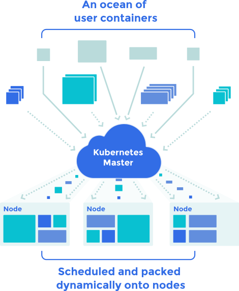
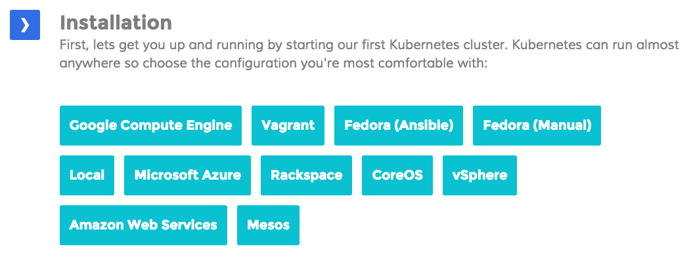

# Container Management: Kubernetes
### 2015 Q3 EMC Accreditation
### Jonas Rosland (@jonasrosland) &
### Matt Cowger (@mcowger)

---

> Kubernetes
> Greek for "pilot" or "Helmsman of a ship"

---

# koo-ber-nay'-tace
## Container management at scale

---

## Manage a cluster of Linux containers as a single system to accelerate Dev and simplify Ops

---



---

# What is it?

An open source container orchestration system

Runs Docker containers

Supports multiple cloud and bare-metal deployments

Made to manage **applications**, not machines

---

# Kubernetes concepts

---

# Container

Sealed application package (Docker)


---

# Clusters

The compute resources on top of which your containers are built

Kubernetes can run anywhere!



---

# Pods

Small group of Docker containers with shared volumes

The smallest deployable unit that can be created, scheduled, and managed with Kubernetes


---

# Replication controllers

Ensures that a specified number of pods are running at any given time

Creates or kills pods as required

If you want to have 4 copies of something running, that the desired state

The RPs always make sure to get to the desired state

---

# Services

Provide a single, stable name and address for a set of pods

They act as basic load balancers

---

# Labels

Used to organize and select groups of objects based on **key:value** pairs.

Examples:
```
role: frontend
stage: production
country: sweden
```

---

# More than just "running" containers

Scheduling - where should my job be run
lifecycle
discovery
constiencu
scale-up
auth
monitoring
health

---

# Primary concepts

0. Container - a sealed application package (Docker)
1. Pod - a small group pf tightly coupled containers
2. Controler - a loop that drives current state towards desired state
3. Service - a set of running pods that work together
4. Labels - identifying metadata attached to other objects
5. Selector - a query against labels, producinng a set result

---

# Pods

Small group of containers, tightly coupled
Shared namespace (share IP and localhost)
Ephemeral (can die and be replaced)
The smallest thing that can be scheduled, it's the "atom" of Kubernetes

---

# Why pods?

By coupling things together they can work better

---
