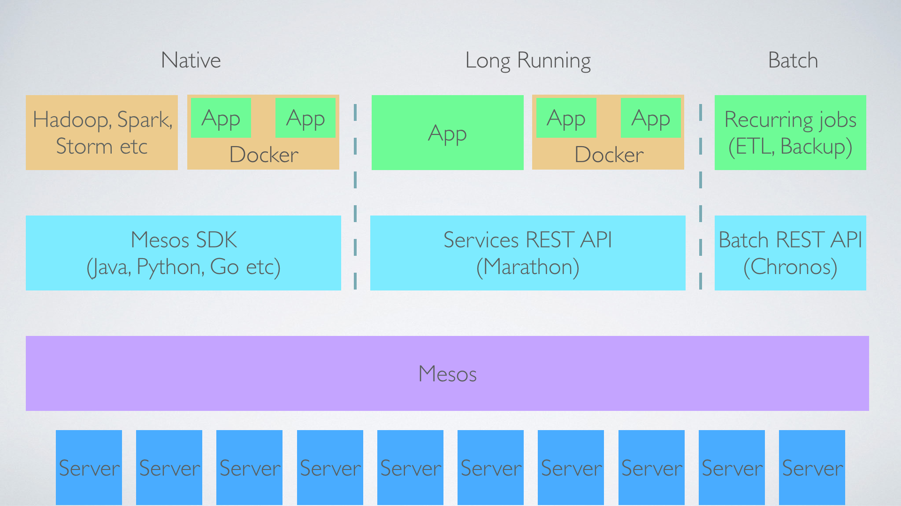

# Container Management: Mesos
### 2015 Q4 EMC Accreditation
### Jonas Rosland (@jonasrosland) &
### Matt Cowger (@mcowger)

---

> Program against your datacenter like it’s a single pool of resources

---

# Apache Mesos

Abstracts CPU, memory, storage, and other compute resources

Enables fault-tolerant and elastic distributed systems

Part of the Apache Software Foundation

---

# Mesos features

Scalability to 10,000s of nodes

Fault-tolerant replicated master and slaves using ZooKeeper

Support for Docker containers

Native isolation between tasks with Linux Containers

---

# Mesos features (cont)

Multi-resource scheduling (memory, CPU, disk, and ports)

Java, Python and C++ APIs for developing new parallel applications

Web UI for viewing cluster state

**Not just for containers!**

---

---

# Marathon

A cluster-wide init and control system for services in cgroups or Docker containers

Built by Mesosphere

Generally considered easier to start with than Apache Aurora

---

---

# Aurora

Apache Aurora is a Mesos framework for long-running services and cron jobs.

Similar to Marathon, but development is driven by Apache instead of Mesosphere

---

# Chronos

A fault tolerant job scheduler for Mesos which handles dependencies and ISO8601 based schedules

Originally built by AirBnB to replace cron

Used for job orchestration

---

---

# So who uses Mesos?

---

# Mesos users

AirBnB, Apple, Cern, Cisco, Coursera, eBay, Ericsson, Foursquare, Hubspot

Netflix, PayPal, Twitter, Uber, UC Berkeley, Yelp

And a lot more!

http://mesos.apache.org/documentation/latest/powered-by-mesos/

---

# Try it out!

https://github.com/mesosphere/playa-mesos

---

# More info

http://mesos.apache.org/

https://github.com/mesosphere/marathon

https://mesos.github.io/chronos/

http://aurora.apache.org/
