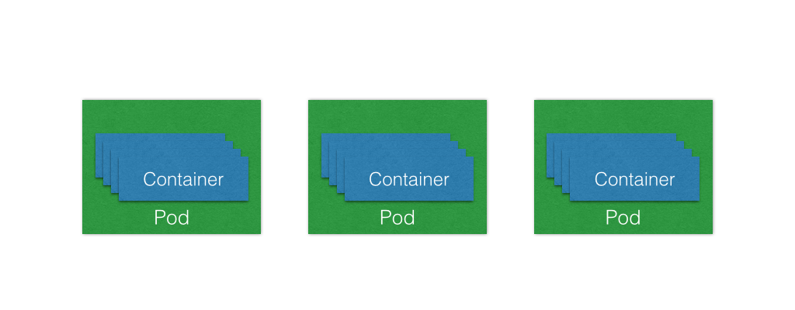
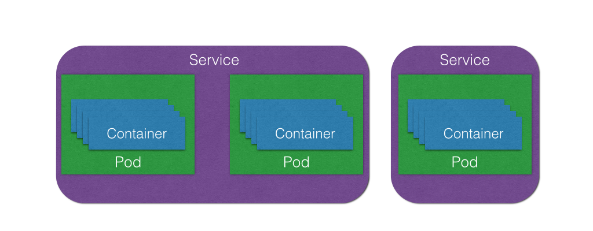
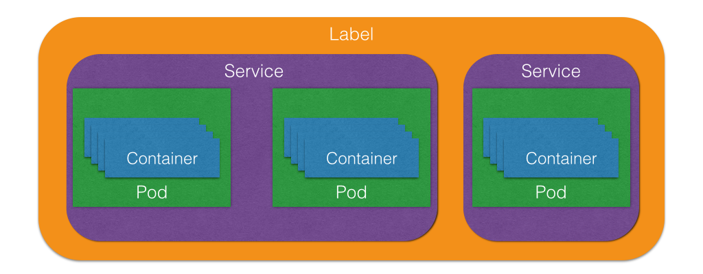

# DevOps tools: Vagrant and Packer
### 2015 Q3 EMC Accreditation
### Jonas Rosland (@jonasrosland) &
### Matt Cowger (@mcowger)

---

# Hashicorp


---

# Hashicorp

Founded in 2012

Creates Open Source software like:
 - Vagrant
 - Packer
 - Serf
 - Consul
 - Terraform
 - Vault

---


---


---

## Manage a cluster of Linux containers as a single system to accelerate Dev and simplify Ops

---


---

# What is it?

An open source container orchestration system

Runs Docker containers

Supports multiple cloud and bare-metal deployments

Made to manage **applications**, not machines

---

# Kubernetes concepts

---

# Container

Sealed application package (Docker)


---

# Clusters

The compute resources on top of which your containers are built

Kubernetes can run anywhere!


---

# Pods

Small group of Docker containers that work together

The smallest deployable unit that can be created, scheduled, and managed with Kubernetes

Example: web server and a content syncer


---

# Replication controllers

Ensures that a specified number of pods are running at any given time

Creates or kills pods as required

If you want to have 4 copies of something running, that's the desired state

The RCs always make sure to get to the desired state

---

# Services

A set of pods that work together

Example: load-balanced backends

---

# Labels

Used to organize and select groups of objects based on **key:value** pairs.

Examples:
```
role: frontend
vs
role: backend
```

---

# So to put it all together

Containers run on clusters

Pods are containers that work together

Services are pods that work together

Labels are used to organize services

---


---



---



---


