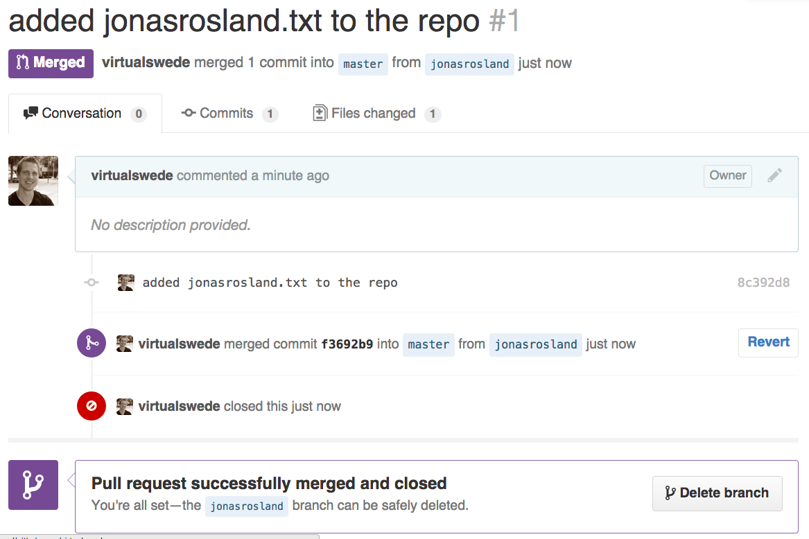

class: center, middle

# Q4 Accreditation Training
## Source Code Control with `Git`

matt cowger (@mcowger) &
jonas rosland (@jonasrosland)

---

# What You'll Learn

* Why use version control
* How to use Git
* How to use GitHub
* What a pull request is
* Branches and why they're really smart

---

# Why use version control

 * Version control records changes that are made so you can recall specific version later
 * Makes it possible for you to work on a feature/bug fix/release without changing production code
 * No more "file-version3.py" or "config-020315.conf"!
 * Since everything is pure text it's easy to "merge" new code into existing

---

# Git

* A distributed version control system, where every user has a complete and full copy of the source code.  
* If you can't check it in, you can't keep track of it, so you can't version it, so you can't automate it.
* *Everything* belongs in source code control, and git is the standard in open source & cloud native.
* Other possible options: subversion (`svn`), mercurial (`hg`), Perforce (`p4`), ClearCase (`cc`).

---

# GitHub

* A freemium service to host Git repositories (repos). Public repos are free, private ones are still cheap.
* Most open source projects are hosted and collaborated on here.

> If you're not on GitHub you don't exist.

-- Friendly developer

---


# How does it work?

1. Initialize a repository
2. Clone the repo
3. Make changes
4. Commit changes
5. Push those changes to the repo
6. ...
7. Profit!

---

# Create a new repo


---

# Clone the repo

```
git clone https://github.com/jonasrosland/training-repo.git
```
  
---

# Make changes

```
cd training-repo
echo "Hello World" > yourname.txt
```

 
---


# Commit changes

```
git add yourname.txt
git commit -m "added yourname.txt to the repo"
```


---


# Push changes


```
git push
```


---


# What happened?

and why?

---


# DENIED!

You're not allowed to push to this repo

--

So how can we collaborate?

Fork it!


---


# Fork a repo


---


# Clone _that_ repo instead of the original one

```
git clone https://github.com/<yourname>/training-repo
```

Repeat your changes, and try to push

What happens?


---


# Compare to the original


---


---


# Create a pull request


---


---


## If a Pull Request is alright, it can then be merged


---


---





---


# Branches


---


# Why use a branch?

Create a branch for every new feature or bugfix

Keeps the "master" clean and with only working code

You can then pull in fixes and features to the master when they're complete

And then create new releases such as v1.1 or v20150215 from master


---


A great cheat sheet:

http://www.clearvision-cm.com/wp-content/uploads/2014/08/Git-Cheat-Sheet_Clearvision.pdf
