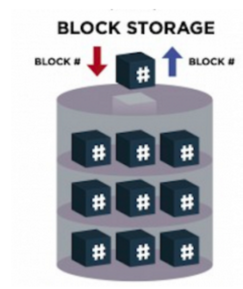
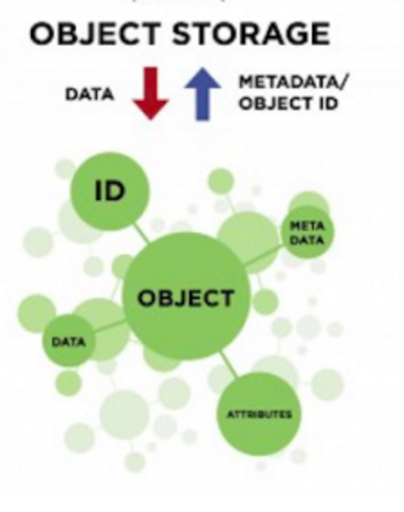

class: center, middle

# Q4 Accreditation Training
## Object Storage Basics

matt cowger (@mcowger) &
jonas rosland (@jonasrosland)

---

# What You'll Learn

* What is object storage
* How do we use it differently
* Why are people using more
* What are the access methods
* How can EMC help

---

# What Is Object Storage?

###Traditional Concepts:

* Block
* File (possibly on top of block)
* Tape

---

## Block

* Accessed via logical block address
* Random access anywhere in the device
* Low latency - transaction focused
* 512 / 4K block sizes
* Difficult to share across systems
* Difficult to replicate efficiently




---

## File

* Accessed via filename
* Random access anywhere in the file
* Moderate latency
* File sizes 2GB-~2PB
* Difficult to share across systems (NFS doesn't count)
* Still focused on transactions

---

## Tape 

* Accessed by 'ID' on tape.
* Linear access only
* Very high latency (think minutes)
* Tough to share
* Focused on $/GB

---

# A 4th Idea - Object Storage 

Something that has:

* low $/GB (not quite as low as tape)
* Easy to share across thousands of systems
* Easy to replicate - eventually consistent
* Accessed by HTTP (modern)
* Objects (of any reasonable size) are the unit of access, not blocks or segments
* Rich metadata
* Response time in hundreds of milliseconds to seconds

---



---

# EMC's Story

* FilePool -> EMC Centerra
* Atmos
* Isilon
* ECS / ViPR Object

---

# Other Common Implementations

* Amazon S3
* Rackspace Files
* Google Cloud Storage
* Scality
* Ceph

---

# Where Is It Used?

* Cloud scale storage of:
  * Images & Videos
  * Audio
  * Documents
  * Large Datasets

---

### How Do I Access It

As a user, transparently via HTTP links (this comes from S3)


---

As a developer, using HTTP and various SDKs:

```bash
curl -X PUT -T "${file}" \
  -H "Host: ${bucket}.s3.amazonaws.com" \
  -H "Date: ${dateValue}" \
  -H "Content-Type: ${contentType}" \
  -H "Authorization: AWS ${s3Key}:${signature}" \
  https://${bucket}.s3.amazonaws.com/${file}
```

```python
import tinys3
conn = tinys3.Connection(KEY,SECRET,tls=True)
f = open('some_file.zip','rb')
conn.upload('some_file.zip',f,'my_bucket')
```

---

#Benefits

* Techniques like SATA drives and erasure coding make it VERY efficient in $/GB ($0.02/GB)
* Native HTTP management and access make it very easy to develop for and access with any language / framework
* Lack of hard consistency makes it easy to replicate across long distances.

---

# In Combination:

Along with cloud native platforms like Cloud Foundry, object storage is commonly used with:

* A modern language like Python or Node.JS
* A NoSQL database for managing user metadata
* A object store for managing large scale user data (uploaded images, music, etc)

---

#Keywords

If your customer is thinking about:

* Cloud Native applications
* Large scale image repositories (including healthcare)
* Hadoop data
* Archive storage

talk to your local object storage specialist