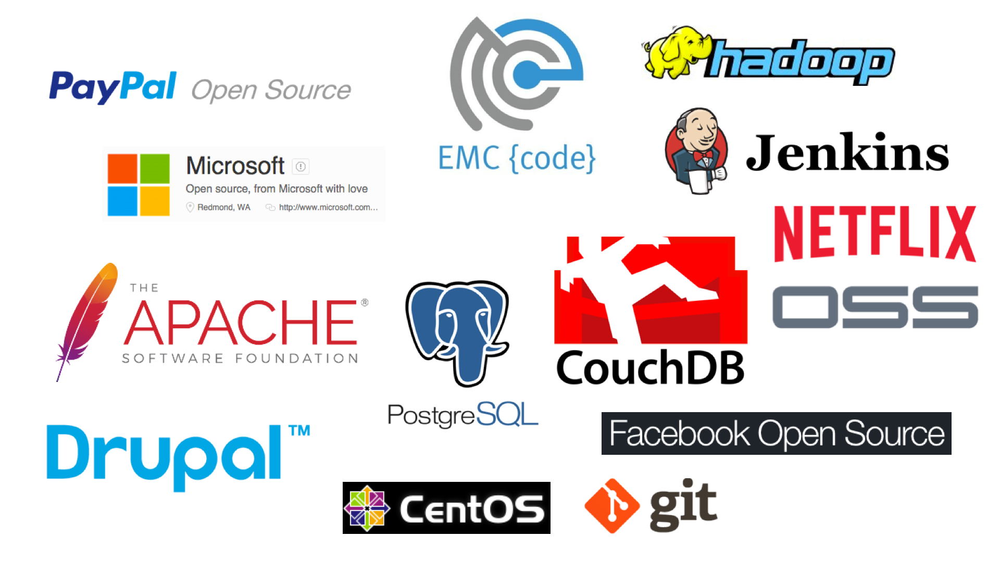

#Open Source is good for business and humanity

## 2016 Q2 EMC Accreditation

### Jonas Rosland (@jonasrosland) &
### Matt Cowger (@mcowger)
#### Research by Kenny Coleman
---

# History of Open Source

---

## The UNIVAC A-2 system was released in 1953 to customers with its source code

^ developed at the UNIVAC division of Remington Rand in 1953, was released to customers with its source code. They were invited to send their improvements back to UNIVAC. Thus it is believed that A-2 was the first example of free and open-source software.

^ As large-scale operating systems matured, fewer organizations allowed modifications to the operating software, and eventually such operating systems were closed to modification. However, utilities and other added-function applications are still shared and new organizations have been formed to promote the sharing of software.

---

## In the early 1970s AT&T distributed early versions of UNIX at no cost to government and academic researchers

^ After UNIX became more widespread in the early 1980s, AT&T stopped the free distribution and charged for system patches

^ In the early 1970s AT&T distributed versions of UNIX at no cost to government and academic researchers, but these versions did not come with permission to redistribute or to distribute modified versions, and were thus not free software in the modern meaning of the phrase. After UNIX became more widespread in the early 1980s, AT&T stopped the free distribution and charged for system patches. As it is quite difficult to switch to another architecture, most researchers paid for a commercial licence.

^ In the late 1970s and early 1980s, computer vendors and software-only companies began routinely charging for software licences, marketing it as "Program Products" and imposing legal restrictions on new software developments, now seen as assets, through copyrights, trademarks, and leasing contracts. In 1979, AT&T began to enforce its licences when the company decided it might profit by selling the Unix system.

---

## In 1983, Richard Stallman published the GNU Manifesto and launched the GNU Project

^In 1983, Richard Stallman published the GNU Manifesto and launched the GNU Project to write a complete operating system free from constraints on use of its source code. Particular incidents motivated this. One case includes an annoying printer couldn't be fixed because the source code was withheld from users. The GNU Manifesto outlined the GNU project's purpose and explained the importance of free software. Soon after the launch, he coined the term "free software" and founded the Free Software Foundation to promote the concept and a free software definition was published in February 1986

---

## The Linux kernel, started by Linus Torvalds, was released as freely modifiable source code in 1991

^ The Linux kernel, started by Linus Torvalds, was released as freely modifiable source code in 1991. The licence wasn't a free-software licence, but in February 1992, Torvalds relicensed the project under the GNU General Public License. Much like Unix, Torvalds' kernel attracted the attention of volunteer programmers everywhere.

^ Until this point, the GNU project's lack of a kernel meant that no complete free-software operating systems existed. The development of the Linux kernel closed that last gap. The combination of these two made the first complete free-software operating system.

---

## In 1995, The Apache HTTP Server was released

---

## In 1997, Eric Raymond published The Cathedral and the Bazaar, a reflective analysis of the hacker community and free-software principles

^ In 1997, Eric Raymond published The Cathedral and the Bazaar, a reflective analysis of the hacker community and free-software principles. The paper received significant attention in early 1998 and was one factor in motivating Netscape to release their popular Netscape Communicator Internet suite as free software. This code is today the basis for Mozilla Firefox and Thunderbird.

^ Netscape's act prompted Raymond and others to look into how to bring free-software principles and benefits to the commercial-software industry. They concluded that FSF's social activism was not appealing to companies like Netscape, and looked for a way to rebrand the free-software movement to emphasize the business potential of the sharing of source code.

---

# Now here's where it gets really interesting

---

## On January 22, 1998, Netscape announces that they will give away their Navigator browser and it's source code

^ http://www.cnet.com/news/netscape-now-for-free/

---

## The “open source” label was created at a strategy session held on February 3rd, 1998 in Palo Alto, California

^ https://opensource.org/history

---

## Then on February 23rd, Netscape created the Mozilla project to coordinate the development of their now Open Source software

---

# Open Source definition

 - Freely accessed, used, changed and shared
 - Open collaboration
 - No vendor lock-in
 - Can be used for commercial purposes

---

# So how do you start with Open Source?

---

# Open Source checklist

1. Have an idea and share it with others
2. Choose a license
3. Start work and publish it
4. Invite the community and grow with it

---

# It's not all just code

We also need:
 - Designers
 - Writers
 - Marketing
 - Community managers
 - And much more

---

## Open Source made it possible

- The Linux, Apache, MySQL, PHP (LAMP) stack
- OpenSSL
- BIND, the DNS server that powers the Internet
- Android devices
- Arduino and the Internet of Things

---

# Who creates Open Source software?

---

---

# Together with and thanks to Open Source we now have

 - Highly available cloud resources
 - Cheap computing
 - Automation tools
 - Short, iterative development cycles
 - Massive amounts of ready-to-run code

---

# Enabling you to move fast

- Industries of: :airplane: - :high_heel: - :dollar: - :car: - :newspaper: - :movie_camera:
- You can start with little to no financial resources
- Global collaboration (acceleration)
- Nothing to hide (bug-fixes, features, security)

---

# To create life-changing opportunities

- Secure communications world-wide
- Self-driving cars
- Retrieving images from the surface of Mars
- Posting pictures on Facebook

---

# 1953 - now
## It all started by sharing code
---

# Resources:

- https://en.wikipedia.org/wiki/History_of_free_and_open-source_software
- https://opensource.org/history
- http://www.cnet.com/news/netscape-now-for-free/
