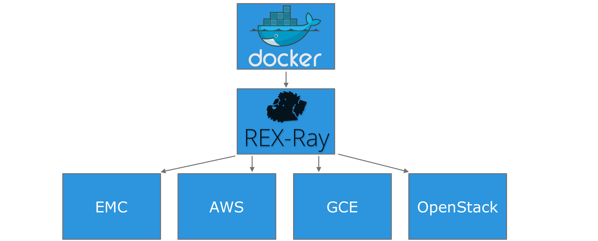
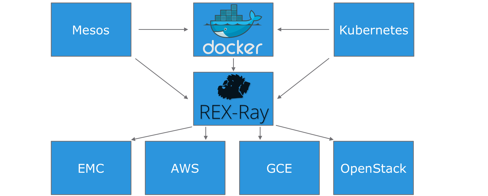

# Project REX-Ray and Modern Data Persistence
### 2016 Q3 EMC Accreditation
### Jonas Rosland (@jonasrosland)
### Matt Cowger (@mcowger)

---

# Problem statement

 - Containers are mostly seen as stateless
 - Storing data in them is risky
 - Tools to store data in containers are not easy to use

---

# Mission

 - Create a storage management component for Docker
 - Be able to handle more than one storage subsystem
 - Integrate and follow Docker’s development cycle
 - Open Source from the start

---

# How does storage in containers work?

 - When a container starts, we can map storage to it
 - For apps such as databases this is a necessity
 - When a container stops, the storage is unmounted and can be reused by another container

---

# Why not use local storage?

- Local storage locks the container’s data to one server
 - Using non-local storage gives us the possibility to move containers across servers
 - Having that possibility is crucial for HA environments

---

# Result

 - Industry recognition and broad use of REX-Ray
 - Focused and ongoing development efforts
 - Simple setup for multiple storage environments:
   - AWS
   - GCE
   - OpenStack
   - Rackspace
   - EMC (ScaleIO, XtremIO, VMAX, Isilon)
   - VirtualBox

---

# Basic possibilities

---

# Advanced possibilities

---

# REX-Ray benefits

 - Gives you the possibility to use any storage platform, and even multiple platforms at the same time
 - Always in sync with Docker’s development cycle
 - Integrated with Docker, Mesos, Marathon and Kubernetes

---

# Demo!

---

# For more information:

http://rexray.readthedocs.io

http://blog.emccode.com

http://emccode.com

https://github.com/emccode/vagrant
