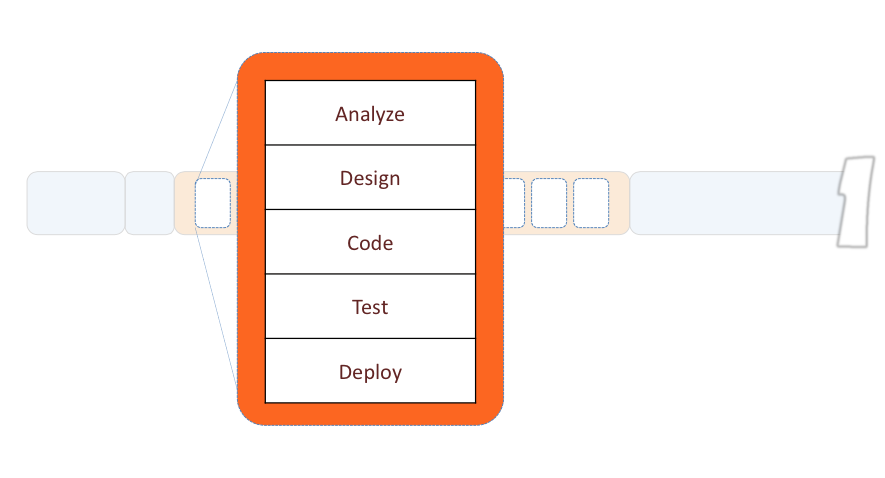
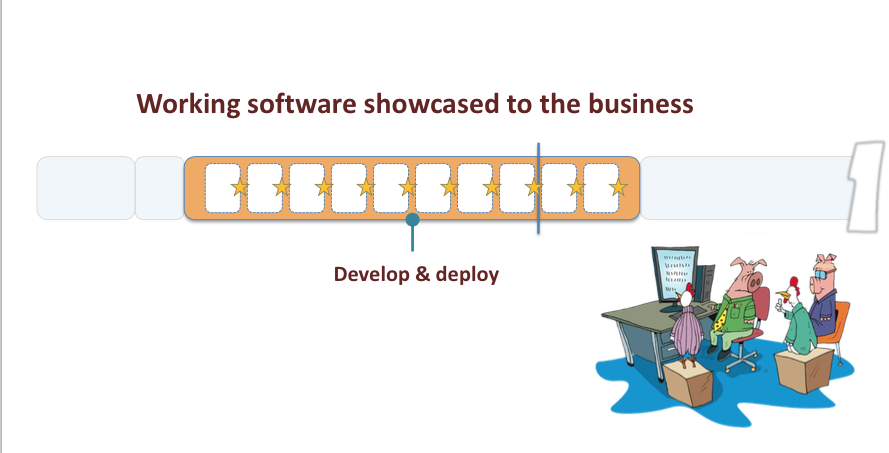
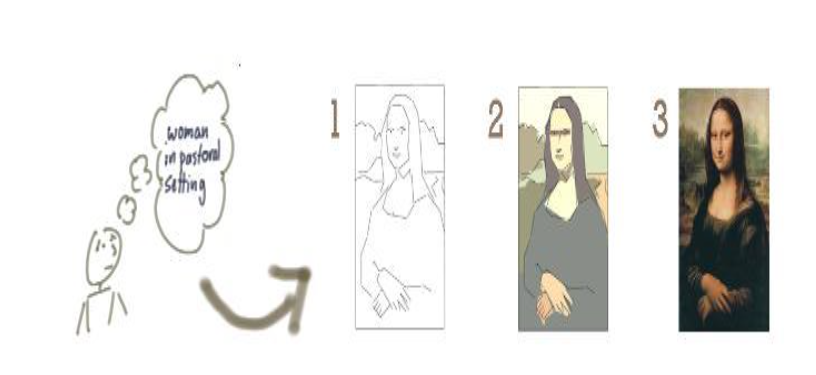
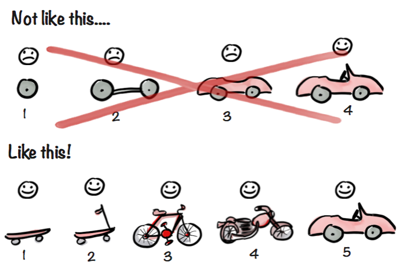

# Agile 101

> - You can't gather all the requirements up front
- The requirements you do gather **will** change
- There is always more to do than time and money will allow

-- The Agile Samurai, J. Rasmusson

^ Open this presentation with [Deckset](http://www.decksetapp.com/)
^ Jonas

---

> 18% of software projects are considered "failed", 43% "challenged"

> 39% actually succeeding

-- 2012 study by [The Standish Group](http://www.versionone.com/assets/img/files/CHAOSManifesto2013.pdf)

---

#Why Agile?

* Too many projects not delivered
* Software taking too long to get to market
* Requirements not met
* High costs to make changes after delivery
* Having to “get it right” first time/up front
*  Too many defects
* Unhappy Customers
* Unhappy Developers

---

# Software Development Methodologies
* "Code-fix” (or no process)
* Structured, heavy weight methodologies a.k.a.
“Plan Driven Methodologies” and “Waterfall”

---
# Software Development Methodologies (cont)

* Largely influenced by _traditional engineering_ and _quality processes_ in industries
* Desire to make software development more _predictable_, _measurable_ and _efficient_
* Strong emphasis on _detailed planning_ and then _executing to the plan_

---

# But Software is Different

* Is not Tangible
* Is not based on Mathematics
* Needs Knowledge Workers

---

# Relevance
###Heavy weight methodologies are most successful when:

 - Requirements are stable
 - Technology is well known and mature
 - Everything happens as one would expect
 - We are not taking on anything new or unknown
 - Coding is ‘copy and paste’

---

# That's not true for most projects though

---

# Projects with these characteristics are few and far between

Heavy weight methodologies work in some instances, but there are high costs, and the risk in using them in dynamic environments is high.

---

# Origins Of Agile

###Agile Methods are a reaction to:

* Rigidity of heavy weight methods
* Bureaucracy introduced by heavy weight methods
* Unpleasant surprises due to lack of visibility
* **The myth that a well defined process is more valuable than the people who use it**

---

# Agile Follows Systems Thinking
* System Thinking is a way of looking at how things influence each other as a whole and not as individual parts
* Focus on Flow, not Function
* Look at the end-to-end process and the value we deliver to our customers
  * What do our customers value
  * How do we respond to the demands from our customers, as a system

---

# Agile Follows Lean Thinking
* Add nothing but value (eliminate waste)
* Flow value from demand (delay commitment)
* Minimize inventory (minimize intermediate artifacts)
* Optimize across the organization

---

# The Agile Manifesto

---

>We are uncovering better ways of developing software by doing it and helping others do it. Through this work we have come to value:

* Individuals and interactions over processes and tools
* Working software over comprehensive documentation
* Customer collaboration over contract negotiation
* Responding to change over following a plan.

>That is, while there is value in the items on the right, we value the items on the left more.

---

#12 Principles of Agile

* Our highest priority is to satisfy the customer through early and continuous delivery of valuable software.
* Welcome changing requirements, even late in development.
* Deliver working software frequently, with a preference to the shorter timescale.

---

#12 Principles of Agile (cont)

* Business people and developers must work together throughout the project.
* Build projects around motivated individuals. Give them the environment and support they need, and trust them to get the job done.
* The most efficient and effective method of conveying information is face-to-face conversation.

---

#12 Principles of Agile (cont)

* Working software is the primary measure of progress.
* Agile processes promote sustainable development. The sponsors, developers, and users should be able to maintain a constant pace indefinitely.
* Continuous attention to technical excellence and good design enhances agility.

---

#12 Principles of Agile (cont)

* Simplicity - the art of maximizing the amount of work not done - is essential.
* The best architectures, requirements, and designs emerge from self-organizing teams.
* At regular intervals, the team reflects on how to become more effective, then tunes and adjusts its behaviour accordingly.

---

# Timeboxing

Timeboxing is used as a project planning technique.

The schedule is divided into a number of separate time periods (timeboxes), with each part having its own deliverables, deadline and budget.

---

# Without Timeboxing

Without timeboxing, projects usually work to a fixed scope

When it is clear that some deliverables cannot be completed, either the deadline slips (to allow more time) or more people are involved (to do more in the same time)

Usually both happen, delivery is late, costs go up, and often quality suffers

---

# With Timeboxing

With timeboxing, the deadline is fixed but the scope may be reduced

Work focuses on the most important deliverables

For this reason, timeboxing depends on the prioritization of deliverables to ensure that it is the project stakeholders who determine the important deliverables rather than software developers

---

#Agile Project Lifecycle
## Timeboxed iterations

---

# The Basics

---

# Lifecycle

---

# Iterative

---

# Incremental

---

# Minimum Viable Product (MVP)

---

# Agile Myths

* No Planning
* No Documentation
* Lacks Discipline
* Limited to Co-Located Teams
* Open Ended

---

#Agile 'Howto'

---

# Backlog

The Product Owner is responsible for creating a list of things he/she wants done, called a backlog.  They have exclusive rights to prioritize this backlog of work.

---

As an end user, I want an app that:

* grabs images from twitter
* filters by hash tag

---

As an ops manager, I want that app to:

* catalog the images in a database so that they can be queried quickly
* log to a web service so that I can evaluate problems easily.

---

# Product Owner

The one person responsible for a project’s success

The Product Owner leads the development effort by conveying his or her vision to the team, outlining work in the scrum backlog, and prioritizing it based on business value

Determines what needs to be built in 30 days or less

---

# Development Teams

Those responsible for committing work to the project

Builds what is needed in 30 days or less and then demos it

Based on the demo the Product Owner determines what to build next

---

# Scrum Master
Serves as a facilitator for both the Product Owner and the team

He or she has no management authority within the team and may never commit to work on behalf of the team

---

# Sprint Planning Meeting

* Timeboxed to 4 hrs
* This meeting is a _conversation_ between the Product Owner and the team
* The team has the power to push back and voice concerns or impediments
* Definition of 'done'

---

## At this point, the Product Owner is typically asked to leave while the team decomposes the sprint backlog items into tasks

---

## While the Product Owner is asked to leave so that the team can candidly discuss the work, he or she is still expected to be “on call” to answer questions

---

# Story Pointing
###The general characteristics of story points include:

* Story points represent the total amount of work required to fully implement a user story
* The stories are estimated independently by team members and the team drives toward a consensus opinion

---

# Story Pointing (cont)

* If a user story is too large to be implemented in one iteration it needs to be broken down into two or more smaller stories
* Many of the estimating models are designed as games that are interesting and engaging for the project team

---

