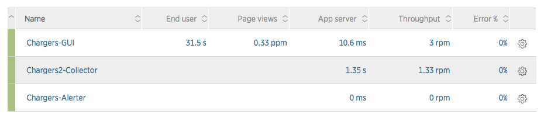
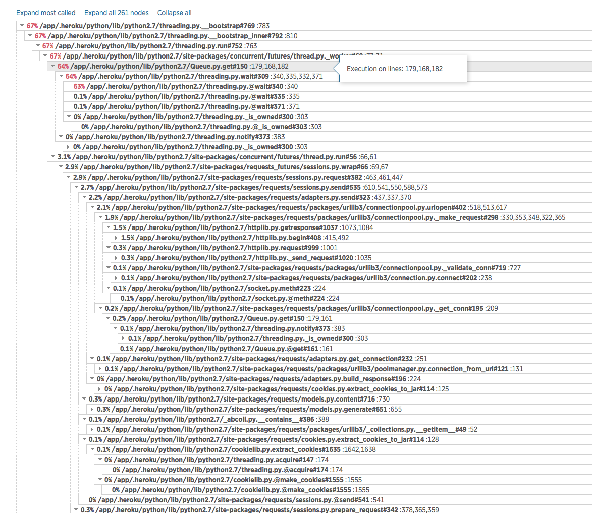

#DevOps Agile Geek Week

>We have done so much,
with so little,
for so long,
we are now qualified to do anything,
with nothing.

--  Konstantin Josef Jirečekt

^ Open this presentation with [Deckset](http://www.decksetapp.com/)

^ Matt

---

# instrumentation

without instrumentation of the application we lack

* visibility into 'normal'
* visibility into problems
* the ability to identify bottlenecks
  * and benchmark effectively
* the ability to plan for capacity
* effective alerting & proactive monitoring

---

# what do i mean by instrumentation?

---

# easy understanding

 

 ---

# easy dashboards

  

---

# easy profiling

---

# tools methods
* usually application integrated
  * imported module or similar: `import newrelic.agent`
  * sometimes a wrapper: `newrelic start appname.py`
* uses builtin language profiling tools
* logs **everything** to service
* usually a hosted SaaS service

---

#examples

* app analytics:
  * new relic
  * datadog
  * stackify
  * AppDynamics
  * RayGun
