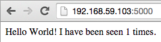
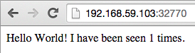
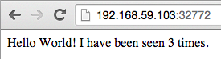

# Docker Compose and Panamax

### Jonas Rosland
### Developer Advocate
#### @jonasrosland
#### jonas.rosland@emc.com
#### emccode.github.io
#### June 2015

^ Run this presentation with [Deckset](http://www.decksetapp.com/)

---

Different types of management

**Developer-focused:**
- Fig
- Panamax

**Ops-focused:**
- Kubernetes
- Mesos
- Tectonic
- Fleet
- Docker Swarm

---

# First a bit of history

---

# Fig

---

## Fig

Fast, isolated development environments using Docker.
Orchard acquired by Docker July 2014
Docker's first acquisition


---

# Docker Compose
# (Fig 2.0)

---

# First, let's verify your installs

1. boot2docker/docker
2. Docker Compose

---

# boot2docker

```
$ boot2docker init
$ boot2docker up
Waiting for VM and Docker daemon to start...
.............................ooooooooooooooooooooooooooooooooooooooo
Started.
```

---

# Docker

```
$ docker version
Client version: 1.6.2
Client API version: 1.18
Go version (client): go1.4.2
Git commit (client): 7c8fca2
OS/Arch (client): darwin/amd64
Server version: 1.6.2
Server API version: 1.18
Go version (server): go1.4.2
Git commit (server): 7c8fca2
OS/Arch (server): linux/amd64
```

---

# Docker Compose

```
$ docker-compose ps
Name   Command   State   Ports
------------------------------
```

---

# Optional: Clean up your Docker environment

```
docker rm `docker images -q`
docker rmi `docker images -q`
```

---

## Docker Compose example (1/3)

Let's define two services:

**web**
- built from Dockerfile
- runs the command `python app.py` inside the image
- forwards the exposed port 5000 on the container to port 5000 on the host machine
- connects to the Redis service
- mounts the current directory inside the container

**redis**, which uses the public image redis

---

## Docker Compose example (2/3)

Dockerfile:

```
FROM python:2.7
ADD . /code
WORKDIR /code
RUN pip install -r requirements.txt
```

---

## Docker Compose example (3/3)

docker-compose.yml:

```
web:
  build: .
  command: python app.py
  ports:
   - "5000:5000"
  volumes:
   - .:/code
  links:
   - redis
redis:
  image: redis
```
---

# So what are we defining?

build - the dir we are building from
command - the command we run inside the container
ports - the ports we open and map to the host
volumes - directory we map as a volume and where we mount it
links - what service we link to (create /etc/hosts lines)

---

# Run it!

```
$ docker-compose up
Creating lab3dockercomposeandpanamax_redis_1...
Pulling image redis:latest...
latest: Pulling from redis
<snip>
Creating lab3dockercomposeandpanamax_web_1...
Building web...
Step 0 : FROM python:2.7
2.7: Pulling from python
<snip>
redis_1 | 1:M 05 Jun 16:20:55.105 * DB loaded from disk: 0.000 seconds
redis_1 | 1:M 05 Jun 16:20:55.105 * The server is now ready to accept connections on port 6379
web_1   |  * Running on http://0.0.0.0:5000/ (Press CTRL+C to quit)
web_1   |  * Restarting with stat
```

---

# Verify that it's running

```
$ docker-compose ps
               Name                             Command             State           Ports
--------------------------------------------------------------------------------------------------
lab3dockercomposeandpanamax_redis_1   /entrypoint.sh redis-server   Up      6379/tcp
lab3dockercomposeandpanamax_web_1     python app.py                 Up      0.0.0.0:5000->5000/tcp
```

---

# Wanna verify more stuff?

---

# docker ps

```
$ docker ps
CONTAINER ID        IMAGE
9f4fe02e2696        lab3dockercomposeandpanamax_web:latest
d01f11317166        redis:latest
```

---

# docker exec

```
$ docker exec -ti 9f4fe02e2696 /bin/bash
root@9f4fe02e2696:/code# ls
Dockerfile  app.py  docker-compose.yml	requirements.txt  test
```

---

# docker exec

```
root@9f4fe02e2696:/code# cat /etc/hosts
172.17.0.7	9f4fe02e2696
127.0.0.1	localhost
<snip>
172.17.0.5	lab3dockercomposeandpanamax_redis_1 d01f11317166
172.17.0.5	redis d01f11317166 lab3dockercomposeandpanamax_redis_1
172.17.0.5	redis_1 d01f11317166 lab3dockercomposeandpanamax_redis_1
```

---

# Sooooo, how do we connect to it?

```
$ boot2docker ip
192.168.59.103
```

---



---

# Refresh!

---


---

# So what have you done?

Built a container from scratch
Run a web app using Flask in the container
Connect it to Redis
Store data in Redis
Retrieve the data and present it

---

# Pretty cool!

---

# What happens if you stop and start it?

---

## Was there anything unneccesary in the Dockerfile or docker-compose.yml?

---

# Some more info on Docker Compose

---

# External links

Link to containers outside Docker Compose using **CONTAINER:ALIAS**

```
external_links:
 - redis_1
 - project_db_1:mysql
 - project_db_1:postgresql
```

---

# Ports

Using the **HOST:CONTAINER** format, don't use ports lower than 60, because YAML will parse numbers in the format xx:yy as sexagesimal (base 60). For this reason, we recommend always adding port mappings as strings.

```
ports:
 - "3000"
 - "8000:8000"
 - "49100:22"
 - "127.0.0.1:8001:8001"
```

---

# What about scaling?

---

# Let's change our docker-compose.yml

```
web:
  build: .
  command: python app.py
  ports:
   - "5000"
  links:
   - redis
redis:
  image: redis
```

---

# Re-run docker-compose up

```
$ docker-compose up
<snip>
$ docker-compose ps
               Name                             Command             State            Ports
---------------------------------------------------------------------------------------------------
lab3dockercomposeandpanamax_redis_1   /entrypoint.sh redis-server   Up      6379/tcp
lab3dockercomposeandpanamax_web_1     python app.py                 Up      0.0.0.0:32770->5000/tcp
```

See the port number?

---



---

# Scale it!

```
$ docker-compose scale web=3
Creating lab3dockercomposeandpanamax_web_2...
Creating lab3dockercomposeandpanamax_web_3...
Starting lab3dockercomposeandpanamax_web_2...
Starting lab3dockercomposeandpanamax_web_3...
```

---

# Check the ports

```
$ docker-compose ps
               Name                             Command             State            Ports
---------------------------------------------------------------------------------------------------
lab3dockercomposeandpanamax_redis_1   /entrypoint.sh redis-server   Up      6379/tcp
lab3dockercomposeandpanamax_web_1     python app.py                 Up      0.0.0.0:32770->5000/tcp
lab3dockercomposeandpanamax_web_2     python app.py                 Up      0.0.0.0:32771->5000/tcp
lab3dockercomposeandpanamax_web_3     python app.py                 Up      0.0.0.0:32772->5000/tcp
```

---


---



---

# So what have you done?

Scaled a web app
Connected all instances to a shared Redis DB
Stored persistent data in Redis
Presented that persistent data using all web instances

---

# Well done!

---

# Panamax

---

## Panamax

An open-source project that makes deploying complex containerized apps as easy as Drag-and-Drop
Created by CenturyLink Labs
Released in August 2014


---


---

## Search for images


---

## Run images in "apps"


---


---

## Manage and add more images to an app


---

## Expose ports


---

## Link containers together


---

# Fin
