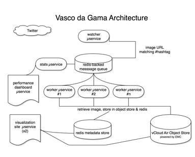

Things DevOps 'is':

* culture and operational model
* focuses on fast feedback cycles
* sustainability

---

Things DevOps is not:

* A group
* A person
* A set of tools
* Puppet
* A workload

---

Advantages:

* 200x faster time to market
* 2x goal achievement rate
* 60x fewer failures

--- 

# Would you like that?

--- 

#thought so.

---

# So, Agile?

---

The Manifesto:

* Individuals and interactions over processes and tools
* Working software over comprehensive documentation
* Customer collaboration over contract negotiation
* Responding to change over following a plan.

---

---

#Cool, so Cloud Native?

---

its all about the promises, baby.

* Traditional Apps expect the infrastructure to make a strong reliability promise
* Cloud Native Apps expect the infrastructure to make a strong scale promise

---

