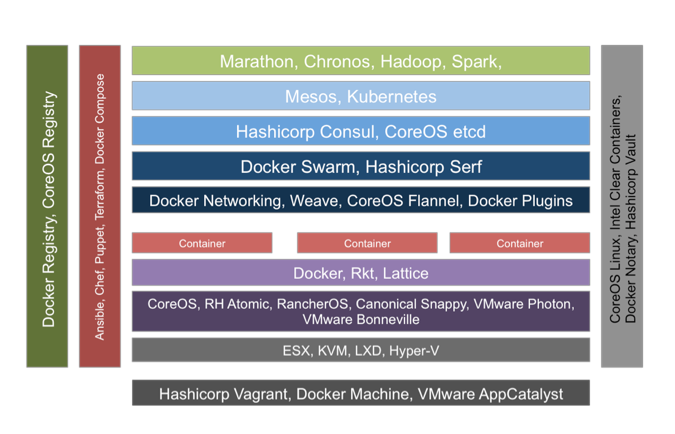
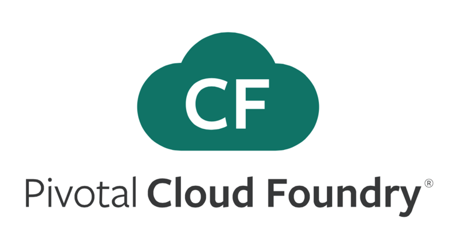

#Cloud Native Platforms

---

A place to run your cloud native applications, with varying levels of assumptions and controls.

---

# Two Primary Categories

##"Unstructured" 

* Ultra-flexible
* Max Opportunity For Optimization
* For Companies Where Platform = Core Competency
* Common In Saas Startups Where There Are Relatively Few Apps

---

---

---

##"Prescriptive" / "Structured"

* Opinionated
* Fastest & Reliable Outcome
* Largest Community Of Talent
* Common In Enterprise Where There Are Many Apps

---

---

---

# The Cloud Foundry Haiku

>    Here is my source code

>    Run it on the cloud for me

>    I do not care how
> 
-- [Onsi Fakhouri](https://twitter.com/onsijoe)

---

#Which One Is Right?

