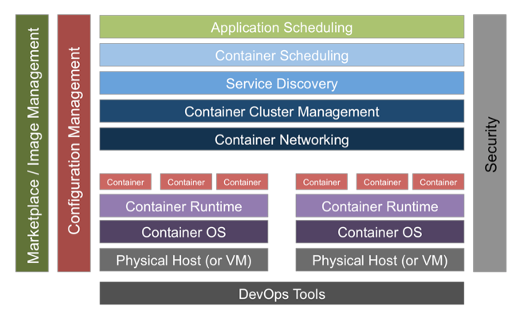
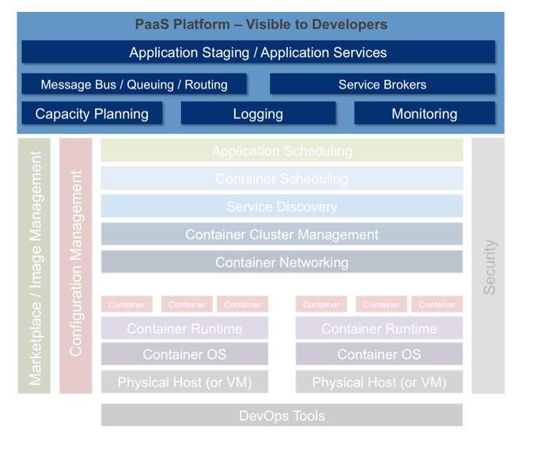

#Cloud Native Platforms

---

A place to run your cloud native applications, with varying levels of assumptions and controls.

---

# Two Primary Categories

---

##"Unstructured" 

* Ultra-flexible
* Max Opportunity For Optimization
* For Companies Where Platform = Core Competency
* Common In Saas Startups Where There Are Relatively Few Apps

---

---

---

---

##"Prescriptive" / "Structured"

* Opinionated
* Fastest & Reliable Outcome
* Largest Community Of Talent
* Common In Enterprise Where There Are Many Apps

---

---

---

# The Cloud Foundry Haiku
>    Here is my source code

>    Run it on the cloud for me

>    I do not care how
> 
-- [Onsi Fakhouri](https://twitter.com/onsijoe)

---

#Which One Is Right?

---

#Unstructured

---

background-image: url(http://thelibertarianrepublic.com/wp-content/uploads/2015/09/Uber-Logo.jpg)

---

background-image: url(https://d2ygrtdi28m8fp.cloudfront.net/corporateAssets/Netflix_Logo_DigitalVideo_0701.jpg)

---

#Structured

---

background-image: url(http://www.mprisk.org/UserFiles/Servers/Server_84508/Image/Logos/Humana%20hum_mdm_rgb_pos.png)

---

background-image: url(https://upload.wikimedia.org/wikipedia/commons/thumb/5/52/Philips_logo_new.svg/2000px-Philips_logo_new.svg.png)